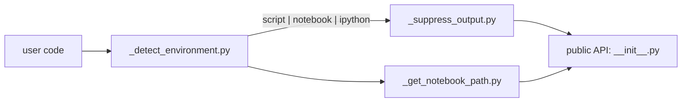

# scitex-context

<p align="center">
  <a href="https://scitex.ai">
    
  </a>
</p>

<p align="center"><b>Execution-context detection (script vs Jupyter vs IPython) and output suppression helpers.</b></p>

<p align="center">
  <a href="https://scitex-context.readthedocs.io/">Full Documentation</a> · <code>uv pip install scitex-context[all]</code>
</p>

<!-- scitex-badges:start -->
<p align="center">
  <a href="https://pypi.org/project/scitex-context/"></a>
  <a href="https://pypi.org/project/scitex-context/"></a>
  <a href="https://scitex-context.readthedocs.io/en/latest/"></a>
  <a href="https://www.gnu.org/licenses/agpl-3.0"></a>
</p>
<p align="center">
  <a href="https://github.com/ywatanabe1989/scitex-context/actions/workflows/ci.yml"></a>
  <a href="https://codecov.io/gh/ywatanabe1989/scitex-context"></a>
</p>
<!-- scitex-badges:end -->

---

## Quick Start

```python
import scitex_context as ctx

if ctx.is_notebook():
    print("Running inside Jupyter")

with ctx.suppress_output():
    noisy_function()
```

## Demo

```mermaid
flowchart LR
    A["import scitex_context as ctx"] --> B{ctx.detect_environment()}
    B -- "python foo.py" --> S["script"]
    B -- "jupyter" --> N["notebook"]
    B -- "ipython REPL" --> I["ipython"]
    S & N & I --> O["ctx.get_output_directory()"]
    N --> P["ctx.get_notebook_path()"]
    A --> Q["with ctx.suppress_output():<br/>    noisy_call()"]
```

<p align="center"><sub><b>Figure 1.</b> Detect-then-adapt: one import reports the execution context, then output-directory and notebook helpers follow it.</sub></p>

## Installation

```bash
uv pip install "scitex-context[all]"
```

Through the umbrella: `uv pip install "scitex[context]"`. Requires Python ≥ 3.10.

<details>
<summary><b>Per-extra installs</b></summary>

<br>

| Extra | Pulls in |
|---|---|
| `dev` | `pytest`, `pytest-cov`, `pytest-timeout`, `ruff`, `scitex-dev` |
| `docs` | `sphinx`, `sphinx-rtd-theme`, `myst-parser`, `sphinx-copybutton`, `sphinx-autodoc-typehints` |

</details>

## Architecture



<p align="center"><sub><b>Figure 2.</b> Module layout: environment detection feeds output suppression and notebook-path helpers, all re-exported from the public API.</sub></p>

Pure-stdlib, zero-dep helpers. The umbrella `scitex.context` import path
is preserved via a `sys.modules`-alias bridge installed at import time.

## 1 Interfaces

<details open>
<summary><strong>Python API</strong></summary>

<br>

```python
import scitex_context as ctx

# Environment detection
ctx.detect_environment()       # "script" | "notebook" | "ipython"
ctx.is_script()                # True if running under `python foo.py`
ctx.is_notebook()              # True under Jupyter
ctx.is_ipython()               # True under bare IPython
ctx.get_output_directory()     # Conventional output dir for current context

# Notebook helpers (no-op outside a notebook)
ctx.get_notebook_path()
ctx.get_notebook_directory()
ctx.get_notebook_name()
ctx.get_notebook_info_simple()

# Output suppression
with ctx.suppress_output():
    noisy_function()

with ctx.quiet():               # alias
    chatty_lib_call()
```

</details>

## Status

Standalone fork of `scitex.context`. Pure stdlib — zero deps. The umbrella
package's `scitex.context` import path is preserved via a `sys.modules`-alias
bridge.

## Part of SciTeX

> `scitex-context` is part of [**SciTeX**](https://scitex.ai). Install via
> the umbrella with `pip install scitex[context]` to use as
> `scitex.context` (Python) or `scitex context ...` (CLI).

>Four Freedoms for Research
>
>0. The freedom to **run** your research anywhere — your machine, your terms.
>1. The freedom to **study** how every step works — from raw data to final manuscript.
>2. The freedom to **redistribute** your workflows, not just your papers.
>3. The freedom to **modify** any module and share improvements with the community.
>
>AGPL-3.0 — because we believe research infrastructure deserves the same freedoms as the software it runs on.

## License

AGPL-3.0-only (see [LICENSE](./LICENSE)).

---

<p align="center">
  <a href="https://scitex.ai" target="_blank"></a>
</p>
